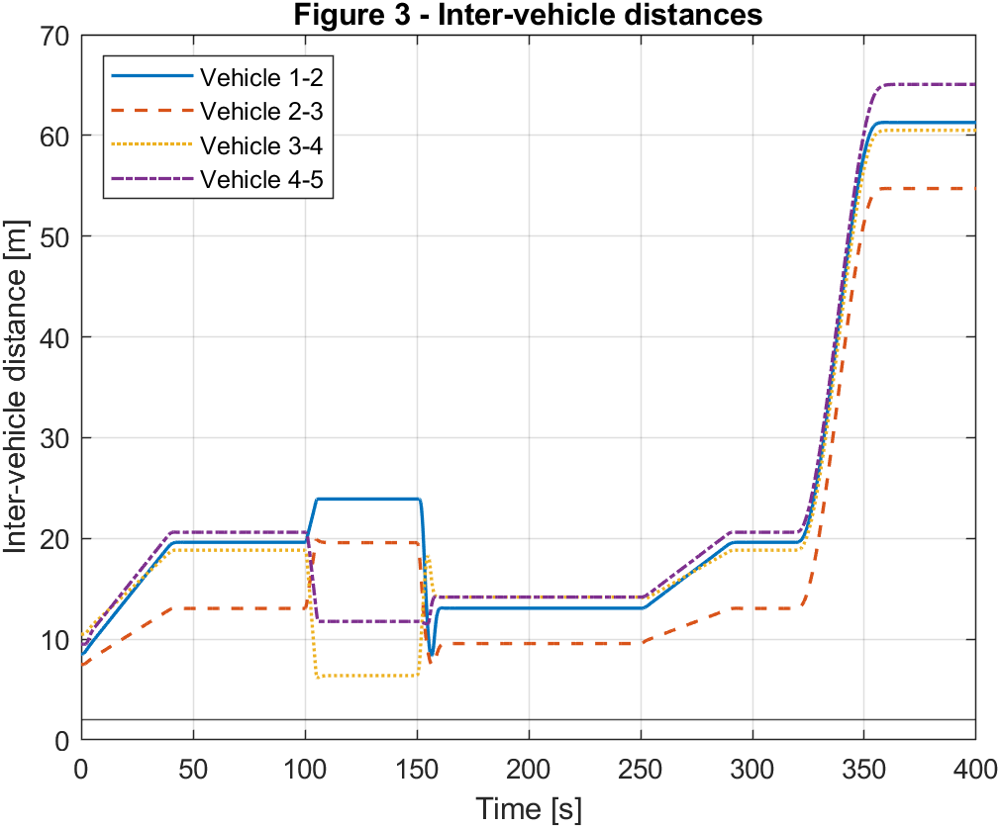
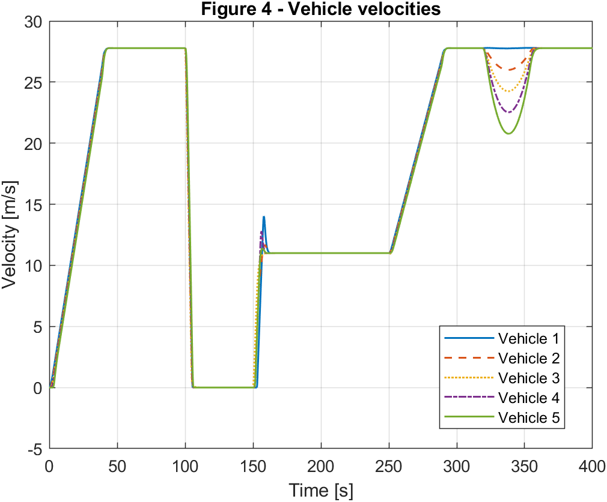
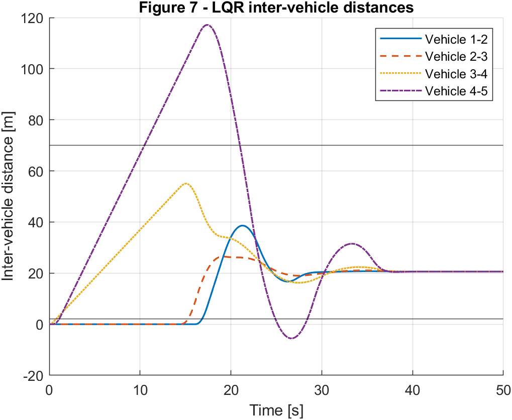

# Model Predictive Control for Vehicle Platooning

This repository contains a MATLAB implementation for reproducing the simulation results of a research paper on Model Predictive Control (MPC) applied to autonomous vehicle platooning.

The project focuses on designing and evaluating a longitudinal MPC controller for a vehicle platoon while considering tracking performance, inter-vehicle spacing, and string stability.

---

## Overview

Vehicle platooning is a cooperative driving strategy where multiple vehicles travel together while maintaining desired distances using communication and control algorithms.

In this project, a platoon of vehicles is modeled using longitudinal dynamics. An MPC controller is designed to predict future vehicle behavior and calculate optimal acceleration commands while satisfying system constraints.

The main goals of this implementation are:

- Modeling the longitudinal dynamics of a vehicle platoon
- Designing an MPC-based controller
- Evaluating spacing and tracking performance
- Comparing MPC performance with an LQR controller
- Analyzing string stability of the platoon

---

## Methodology

The implemented control framework consists of several main components.

### Vehicle Model

A longitudinal vehicle model is used to describe vehicle motion. The model considers the relationship between acceleration input, velocity, and position dynamics.

### Model Predictive Control

The MPC controller solves a constrained optimization problem at each sampling time.

The controller predicts the future behavior of the vehicle platoon over a finite horizon and computes the optimal control input by minimizing a cost function.

The optimization considers:

- Vehicle tracking error
- Desired inter-vehicle spacing error
- Control effort
- System constraints

### Vehicle Spacing Policy

A constant time headway spacing policy is implemented to maintain safe distances between consecutive vehicles.

### Human Driver Model

A human driver behavior model is included to generate disturbance scenarios and evaluate controller robustness.

### LQR Comparison

An LQR controller is implemented as a baseline method to compare the performance of MPC under the same simulation conditions.

---

## Simulation Scenarios

The following simulation cases are implemented:

### Main Platooning Scenario

Evaluation of vehicle platoon tracking performance under normal driving conditions.

### MPC vs LQR Comparison

Comparison between MPC and LQR controllers in terms of:

- Tracking accuracy
- Spacing error
- Control effort

### String Stability Analysis

Evaluation of disturbance propagation through the platoon to analyze string stability.

---

## Results

## Results

### Vehicle Tracking



### Spacing Error



### String Stability


## How to Run

### Requirements

- MATLAB R2022a or newer
- Optimization Toolbox
- Control System Toolbox

### Execution

Clone this repository and open MATLAB in the project directory.

Run:

```matlab
run_all
```

The script automatically adds required paths and executes all simulation scenarios.

---

## Main Files

| File | Description |
|---|---|
| `run_all.m` | Main script for running the complete project |
| `simulate_main_scenario.m` | Main platooning simulation |
| `simulate_lqr_comparison.m` | MPC and LQR comparison |
| `simulate_string_stability.m` | String stability analysis |
| `create_vehicle_model.m` | Vehicle dynamic model |
| `create_platoon_qp.m` | MPC optimization formulation |

---

## Software Environment

The project was developed and tested using MATLAB.

Recommended environment:

- MATLAB R2022a or newer
- Optimization Toolbox
- Control System Toolbox

---
## Reference

This project is based on the following paper:

J. M. Kennedy, J. Heinovski, D. E. Quevedo, and F. Dressler,
"Centralized Model-Predictive Control with Human-Driver Interaction for Platooning,"
IEEE International Conference on Intelligent Transportation Systems (ITSC), 2022.
---

## Purpose

This repository is created for research and educational purposes, focusing on the implementation and analysis of Model Predictive Control for autonomous vehicle platooning.

The goal is to provide a reproducible MATLAB implementation of the proposed control approach and its simulation results.